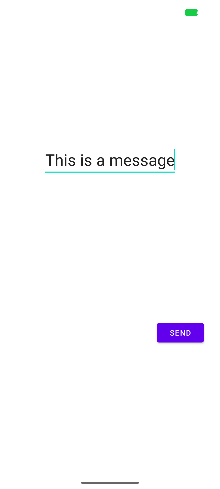
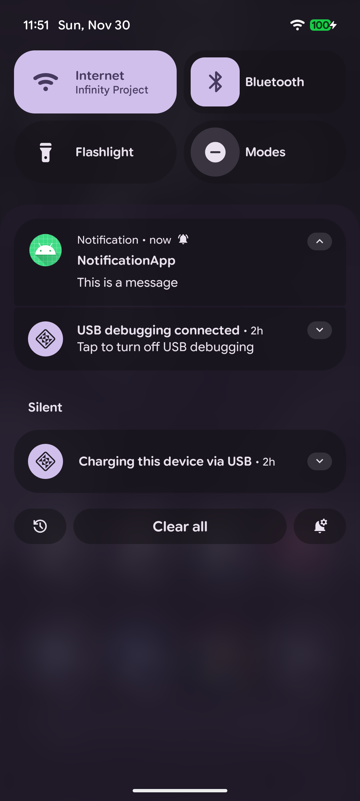

# Notification Demo App
A simple Android app that demonstrates how to send notifications and handle click actions to open another Activity with user input.

## Features
- Enter text in an EditText and submit.
- Sends a notification with the entered text.
- Clicking the notification opens a ResultActivity displaying the message.
- Demonstrates PendingIntent, NotificationCompat, and NotificationChannel.

## Screenshots

## Installation
1. Clone this repository: git clone https://github.com/s4ndrang/notificationAndroid.git
2. Open the project in Android Studio.
4. Run the app on an emulator or physical device.

## Usage

1. Enter your message in the text field on MainActivity.
2. Press **Send**.
3. Swipe down to see the notification (or click it if using Android 13+ with permission granted).
4. Click the notification to open ResultActivity with your message.

## Technologies
- Language: Java
